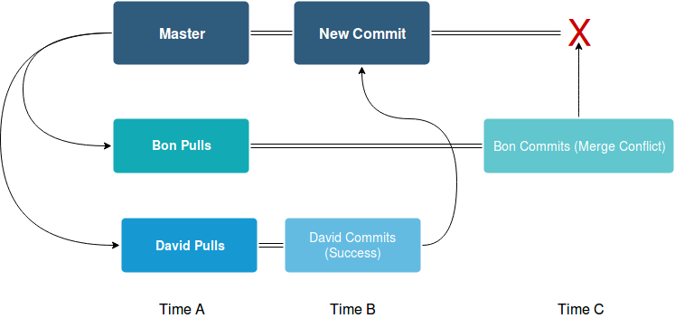

## Avoiding Merge Conflicts

When we start to diverge from working in the same area, we can use the [Feature Branch Workflow](https://www.atlassian.com/git/tutorials/comparing-workflows/feature-branch-workflow). For now, while we work on XML and JavaFx, following these rules will suffice:

1. **Pull before you code.** If you pull before you add anything new, then it will diminish the chance of a merge conflict. 
2. **Test before committing to master.** Make sure all the features that worked before still work (we don't have many features, so we can go through everything eg. test drag & drop, changing window sizes etc.)


## Fixing Merge Conflicts

Preliminary reading: It might help to go through the article, [How to undo (almost) anything with Git](https://github.blog/2015-06-08-how-to-undo-almost-anything-with-git/) , before moving on.	

**Potential Merge Conflicts:** If, you pull before you code, there's only one type of merge conflict that may arise. Say Bon and David both pull at time A. They work on the same file, but David manages to push first at time B. Then, when Bon tries to push at time C, he'll be prevented from doing so. Bon has a merge conflict; git won't allow him to push or pull from the master until it is resolved.


### Find the Merge-Conflicted Files

How do we resolve a merge conflict? Bon should first find out which files are causing the problems 

```
! [rejected]        master -> master (fetch first)
error: failed to push some refs to 'https://github.com/dahadaller/testing.git'
hint: Updates were rejected because the remote contains work that you do
hint: not have locally. This is usually caused by another repository pushing
hint: to the same ref. You may want to first integrate the remote changes
hint: (e.g., 'git pull ...') before pushing again.
hint: See the 'Note about fast-forwards' in 'git push --help' for details.
```


The first thing to do when you see an error like the one shown above is to find out which files are causing the merge conflict.

```bash
git fetch
```

> You can consider `git fetch`the 'safe' version of [git pull]. It will download the remote 
> content but not update your local repo's working state, leaving your current work intact.
>
> - from [Atlassian](https://www.atlassian.com/git/tutorials/syncing/git-fetch)

Git fetch let's you download without overwriting. This will allow us to compare our files with the files already on the remote. After you've fetched, you want to find the lines that are different between the remote branch and your local branch. According to [Stack Overflow](https://stackoverflow.com/questions/1800783/how-to-compare-a-local-git-branch-with-its-remote-branch), after you've fetched, you can first see all available branches (both local and remote) with

```bash
git branch -a
```

Then you can chose two of the branches to compare. For example, if I want to compare my local master and the remote master (also known as the origin) I would execute the following command:

```bash
#git diff <masterbranch_path> <remotebranch_path> 
git diff master origin/master
```

The output that results should look something like this:

```
[testing]:git diff master origin/master
diff --git a/README.md b/README.md
index 3f43dfc..77dc2ad 100644
--- a/README.md
+++ b/README.md
@@ -1,4 +1,4 @@
 # testing
 just a repo to test merge conflicts
 - Here's a good line I'd like to commit
-- Here's a line that will merge a cause conflict.
+- This line will cause a merge conflict.
```

From the example above, we can see that all the errors are in README.md


### Find the Last Good Commit (and it's SHA)

Now that we know where the problem is, we have to find a way to push our local changes to GItHub. First, we need to find the commit we want to go back to. We can do this with 

```bash
git log --all
```

 which will give us the output:

```bash
[testing]:git log --all
commit 11ce889a4ed3de769d15d4588d29767beeb2df19 (HEAD -> master)
Author: david <dahdadaller@gmail.com>
Date:   Tue Mar 19 16:21:09 2019 -0400

    What could go wrong?

commit 6e928f196715bb15e8609c1bc6dac080b4a7a290 (origin/master, origin/HEAD)
Author: david <dahdadaller@gmail.com>
Date:   Tue Mar 19 16:20:13 2019 -0400

    The last commit before conflict.

commit e6fb3105214fc8ba1eee3c6164a6b4ff0ed7f91d
Author: david <dahdadaller@gmail.com>
Date:   Tue Mar 19 16:16:10 2019 -0400

    Good commit. No bugs here.

commit b5e353bfe9ae0a81a789cd965cbdf43db501875b
Author: David Hadaller <dahadaller@users.noreply.github.com>
Date:   Tue Mar 19 16:14:40 2019 -0400

    Initial commit

```

In the output shown above, the commit with the message "What could go wrong?" is our last local commit (where the HEAD is pointing). The commit with the message  "The last commit before conflict." is the last remote commit to our repository on GitHub, `origin/master`.

### Copy the Merge-Conflicted Files

Then we'll save a copy the merge-conflicted files elsewhere (eg. the desktop.) so we can have a copy of our old work for the next few steps.


### Reset The Local Repository

We can now revert back to the last working commit using the following command mentioned from the [How to undo (almost) anything with Git](https://github.blog/2015-06-08-how-to-undo-almost-anything-with-git/) article.  We can restore the state of our local repo to match what's on the GitHub with the following command. Note we got `<last good sha>`  from the `git log` command.

```bash
#git reset <last good SHA>
git reset 6e928f196715bb15e8609c1bc6dac080b4a7a290
```


### Checkout the Merge-Conflicted Files

After this, you will notice that all your files appear the same in your text editor. To erase your uncommitted changes on the conflicted `README.md` you can run

```bash
#git checkout <bad filename>
git checkout README.md
```

After that, pull from the remote 

```bash
git pull
```

After that, you can then copy the important content from the copy of `README.md` (the one on your desktop) to the `README.md` in your local repository. Then commit as you normally would.

```bash
git add .
git commit -m "Your Commit message"
git push origin master
```

